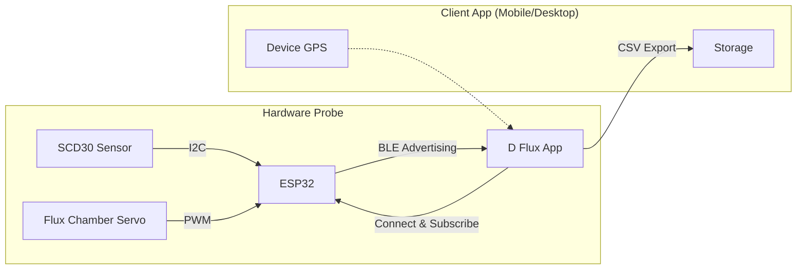

# D Flux

**Environmental Data Acquisition & Analysis System**

D Flux is a complete ecosystem for monitoring environmental parameters, specifically designed for soil CO₂ flux measurements. It combines a custom ESP32-based hardware probe with a cross-platform application for real-time data visualization, analysis, and geospatial mapping.

## System Overview

The system consists of two main components working in tandem:

1.  **Probe (Firmware)**: An ESP32 microcontroller reading data from an SCD30 sensor (CO₂, Temperature, Humidity). It handles sensor calibration, controls auxiliary hardware (servos for chamber operation), and streams data via Bluetooth Low Energy (BLE).
2.  **App (Client)**: A desktop and mobile application (Windows, Linux, macOS, Android) that connects to the probe. It visualizes the data stream, enriches it with GPS coordinates from the mobile device, performs linear regression analysis to calculate CO₂ flux, and exports datasets.

## Key Features

- **Real-time Monitoring**: Live streaming of CO₂ concentration, Temperature, and Humidity.
- **Flux Analysis**: Built-in tools to calculate CO₂ flux slope (ppm/s) and R² using linear regression on selected data ranges.
- **Geospatial Data**: Automatic GPS tagging of measurements using the mobile device's location services.
- **Cross-Platform**: Run the same client application on your laptop or Android smartphone.
- **Data Export**: Comprehensive CSV export for raw sensor data and analyzed flux results.
- **Calibration**: Full support for SCD30 sensor calibration (both software offsets and hardware forced recalibration).

## Repository Structure

This monorepo contains the entire source code for the project:

- **[`client/`](client/)**: The Tauri 2 + Vue 3 application.
  - _Tech Stack_: TypeScript, TailwindCSS, Pinia, Unovis (Charts), Leaflet (Maps).
- **[`firmware/`](firmware/)**: The ESP32 firmware.
  - _Tech Stack_: PlatformIO, Arduino Framework, NimBLE-Arduino.

## Getting Started

To get the system running, you will need to set up both the hardware and the client application. Please refer to the specific documentation for each component:

### 📱 Client Application

Build and run the desktop/mobile app.

[**Read Client Documentation →**](client/README.md)

### 🔌 Firmware

Flash the ESP32 microcontroller.

[**Read Firmware Documentation →**](firmware/README.md)

## Architecture

---

