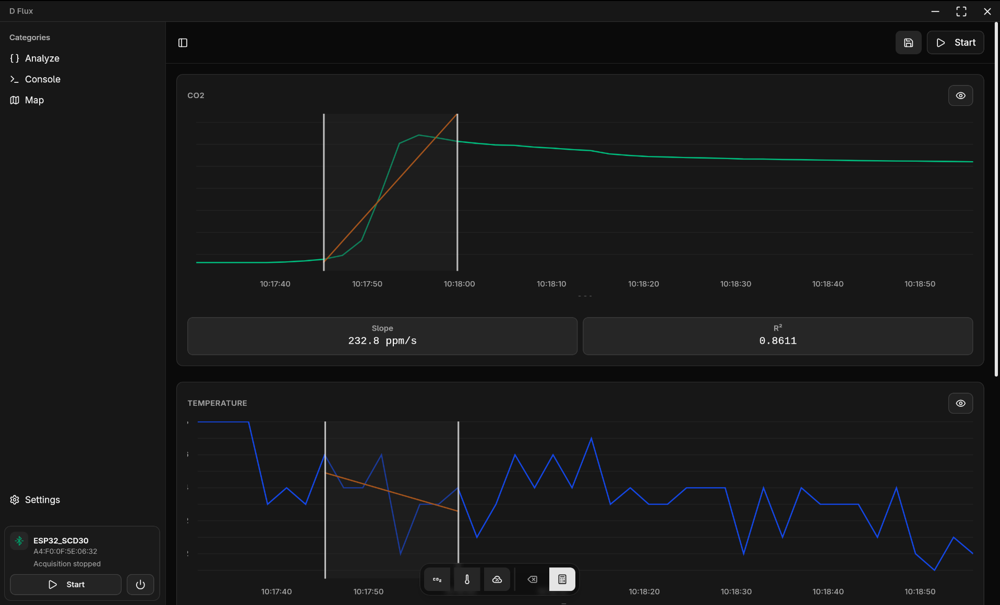

# D Flux

A cross-platform application for acquiring and analyzing environmental data from ESP32 microcontrollers equipped with CO₂ sensors (SCD30) via Bluetooth Low Energy (BLE).



## Overview

This project consists of two main components:

- **ESP32 Firmware**: Reads environmental data (CO₂, temperature, humidity) from SCD30 sensor and exposes it via BLE
- **Desktop/Mobile Application**: Built with Tauri 2 + Vue 3, connects to ESP32, receives real-time data, enriches with GPS coordinates, and provides data analysis capabilities

## Features

### Core Functionality

- **BLE Device Scanning**: Automatically discovers compatible ESP32 devices
- **Real-time Data Acquisition**: Receives CO₂ concentration, temperature, and relative humidity data
- **GPS Integration**: Automatically enriches data with GPS coordinates on mobile devices
- **Data Export**: Export acquisition sessions to CSV format for further analysis
- **Flux Analysis**: Perform linear regression analysis on selected data ranges to calculate CO₂ flux (slope), R², and min/max stats
- **Interactive Mapping**: Visualize measurement locations on an interactive map powered by Leaflet
- **Calibration**:
  - **Software Calibration**: Apply Offset and Multiplier to CO₂ readings on the client side
  - **Hardware Calibration**: Trigger forced recalibration (FRC) on the SCD30 sensor
- **Console**: Send raw commands to ESP32 devices for advanced control

### Technical Architecture

#### ESP32 Firmware

- **Sensor**: Adafruit SCD30 for CO₂, temperature, and humidity measurements
- **BLE Stack**: NimBLE-Arduino for BLE server functionality
- **Framework**: Arduino framework for main loop and GPIO control

#### BLE GATT Design

- **Service UUID**: `DB594551-159C-4DA8-B59E-1C98587348E1`
- **RX Characteristic** (App → ESP32): `7B6B12CD-CA54-46A6-B3F4-3A848A3ED00B` (WRITE | WRITE_NR)
- **TX Characteristic** (ESP32 → App): `907BAC5D-92ED-4D90-905E-A3A7B9899F21` (READ | NOTIFY)

#### Communication Protocol

The application uses a simple line-based text protocol:

```
HEADER PAYLOAD\n
```

**Events (ESP32 → App):**

- `DATA CO2=400.12;TMP=24.50;HUM=40.10` - Real-time sensor readings
- `WHOIS ID=ESP32_01;ORG=INGV;FW=1.0` - Device identification
- `ACQUISITION_STATE <0|1>` - Confirmation of recording state
- `SETTINGS offset=0;multiplier=1` - Current calibration settings
- `HW_CALIBRATION_REF <val>` - Current hardware calibration reference
- `ERROR <message>` - Error reporting

**Commands (App → ESP32):**

- `START_ACQUISITION` - Start recording data
- `STOP_ACQUISITION` - Stop recording data
- `GET_ACQUISITION_STATE` - Query current recording state
- `GET_SETTINGS` / `SET_SETTINGS <params>` - Manage software calibration
- `GET_HW_CALIBRATION_REF` / `SET_HW_CALIBRATION_REF <val>` - Manage hardware calibration
- `DISCONNECT` - Gracefully close connection

## Installation

### Prerequisites

- Node.js (v18 or higher)
- pnpm package manager
- Rust and Cargo (for Tauri)

### Setup

1. Clone the repository:

```bash
git clone <repository-url>
cd d-flux
```

2. Install dependencies:

```bash
pnpm install
```

3. Set up environment variables:

```bash
cp example.env .env
# Edit .env with your configuration
```

## Development

### Running the Application

```bash
# Development mode
pnpm dev

# Build for production
pnpm build

# Android build
pnpm android-build
```

### Tauri Commands

```bash
# Tauri development
pnpm tauri dev

# Tauri build
pnpm tauri build
```

## Application Structure

### Frontend (Vue 3 + TypeScript)

- **Components**: Modular Vue components for different views and functionality
- **State Management**: Pinia for application state
- **UI Framework**: TailwindCSS v4 + shadcn/vue (reka-ui)
- **Charts**: Unovis
- **Maps**: Leaflet

### Key Views

- **Dashboard**: Main interface for device connection and data visualization
- **Analyze**:
  - **Data View**: Visualize session data with brush selection
  - **Flux Analysis**: Calculate slope (ppm/s) and R² for selected ranges
- **Settings**:
  - **Appearance**: Dark/Light mode
  - **Storage**: Configure data save location
  - **Device**: Manage CO₂ calibration (Software & Hardware)
- **Console**: Raw command interface for ESP32 communication

## Data Export

The application exports data in CSV format:

- **Session Data**: Complete acquisition sessions (`YYYY-MM-DD-sensor-1.csv`)
  - Includes raw readings: Timestamp, GPS, CO₂, Temp, Humidity
  - Includes Metadata header with session stats (Avg/Min/Max) and active calibration values
- **Flux Data**: Analysis results saved to `flux_data.csv`
  - Appends new rows for each analysis performed
  - Columns: Timestamp, Sensor, Location, CO₂ Slope, R², Min/Max stats, Calibration used

## BLE Device Identification

ESP32 devices include metadata in advertising packets:

- Format: Manufacturer Specific Data with key-value pairs
- Example: `ID=ESP32_01;ORG=INGV;FW=1.0`
- Enables device identification without connection

## Development Notes

### Icon Management

To update the application icon:

1. Place `app-icon.png` at the project root
2. Run: `pnpm tauri icon`

### Android Development

For Android emulator testing:

```bash
~/Android/Sdk/emulator/emulator -avd Medium_Phone_API_36.1
```

### Mock Mode

To develop without a physical device, enable Mock Mode in `.env`:

```bash
VITE_USE_MOCK=true
```

## Technology Stack

### Frontend

- **Vue 3**
- **TypeScript**
- **TailwindCSS v4**
- **Pinia**
- **Unovis** (Charts)
- **Leaflet** (Maps)
- **PapaParse** (CSV)

### Backend (Tauri)

- **Rust**
- **Tauri 2**
- **Plugins**:
  - `@mnlphlp/plugin-blec` (BLE)
  - `@tauri-apps/plugin-geolocation` (GPS)
  - `@tauri-apps/plugin-fs` / `tauri-plugin-android-fs-api` (File System)
  - `@tauri-apps/plugin-os` (Platform detection)

## Contributing

1. Fork the repository
2. Create a feature branch
3. Make your changes
4. Test thoroughly
5. Submit a pull request

## License

[MIT License](LICENSE)
